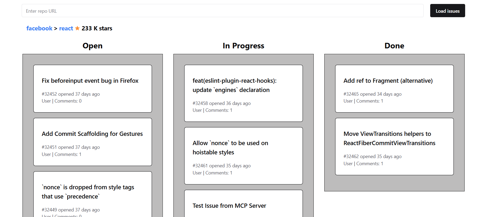

# GitHub Issues Board

## Overview  

**GitHub Issues Board** is a web application that allows users to fetch and manage issues from any public GitHub repository. Built with **Vite**, **TypeScript**, and **React**, this app provides an intuitive drag-and-drop interface for organizing issues into three categories:  

- **ToDo** (new issues)  
- **In Progress** (open issues with an assignee)  
- **Done** (closed issues)  

User preferences, including issue positions and order, are **persisted across sessions** to maintain custom arrangements.  

## Features  

✔ **Search by Repository** – Enter a GitHub repository URL and fetch issues dynamically.  
✔ **Drag-and-Drop Support** – Easily move issues between categories.  
✔ **Persistent State** – Changes to issue order and status are saved across searches and sessions.  
✔ **Direct Links** – Quick access to the repository and owner's profile.  
✔ **Optimized Performance** – Powered by Vite for fast development and builds.  
✔ **Redux for State Management** – Efficient issue tracking and updates.  

## Installation  

To set up the project locally, follow these steps:  

1. Ensure **Node.js LTS version** is installed.  
   - [Download and install Node.js](https://nodejs.org/en/) if necessary.  
2. Install project dependencies:  `npm install`.
3. Start the development server: `npm run dev`.

4. Open your browser and navigate to:
[http://localhost:5173](http://localhost:5173). 

The page will reload automatically when changes are made.

## Project Structure
/
├── dist                    # Compiled and built project output
├── public                  # Static assets (icons, public files)
│   ├── vite.svg
│
├── src                     # Source code
│   ├── assets              # Static assets (images, SVGs)
│   ├── components          # React components
│   │   ├── repoSection     # Repository search and display
│   │   ├── reqForm         # Input form for repo search
│   │   ├── sectionItem     # Individual board section
│   │   ├── sectionList     # List of board sections
│   │   ├── taskItem        # Individual task component
│   │   ├── taskList        # List of tasks per section
│   │   ├── ui              # UI-related reusable components
│   │
│   ├── constants           # Application-wide constants
│   ├── redux               # State management (Redux)
│   │   ├── slices          # Redux slices for state updates
│   │   ├── store.ts        # Main Redux store configuration
│   │   ├── operators.ts    # Async operations (e.g., API calls)
│   │   ├── selectors.ts    # Selectors for accessing state
│   │
│   ├── types               # TypeScript type definitions
│   ├── utils               # Helper functions (e.g., local storage, task management)
│   ├── App.tsx             # Main application component
│   ├── main.tsx            # Application entry point
│   ├── vite-env.d.ts       # TypeScript environment types
│
├── .gitignore              # Git ignored files
├── index.html              # Main HTML file
├── package.json            # Project metadata and dependencies
├── vite.config.ts          # Vite configuration
├── vitest.config.ts        # Vitest configuration for testing
├── tsconfig.json           # TypeScript global config
├── tsconfig.app.json       # TypeScript config for application files
├── tsconfig.node.json      # TypeScript config for Node.js files
├── eslint.config.js        # ESLint configuration
├── README.md               # This documentation file

## How It Works
1. Enter a GitHub repository URL (e.g., https://github.com/facebook/react) in the input field and press Load.
2. The app fetches issues from the repository using the GitHub API.
3. Issues are categorized into:
 - ToDo – All new issues.
 - In Progress – Open issues with an assignee.
 - Done – Closed issues.
4. Drag and drop issues between columns to update their status and order.
5. Changes are saved between sessions.
6. Click on the repository name or owner's profile to visit them on GitHub.
Enjoy building with GitHub Issues Board! 🚀